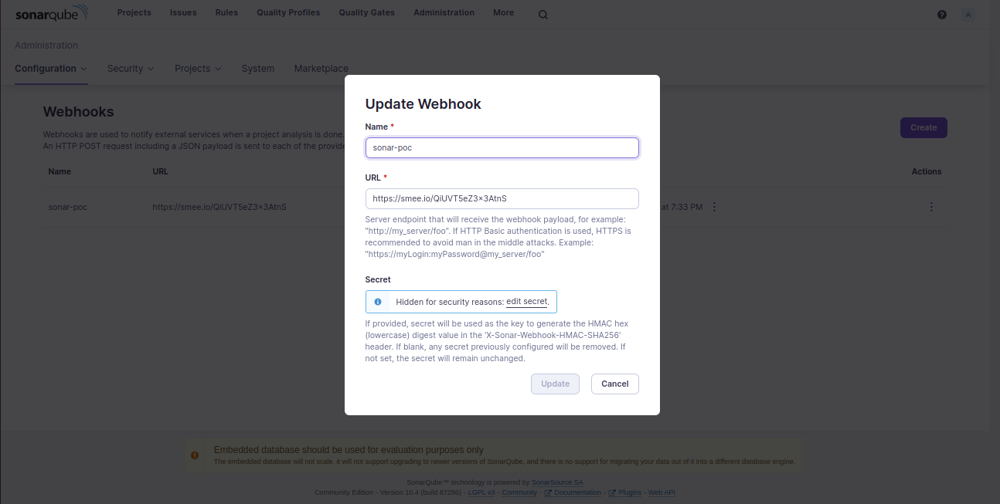

### Webhook setup
1. Go to Administration > Configuration > Webhook and create a webhook
2. We are use 3rd party payload delivery service for webhook, here is the example for smee
    1. Go to https://smee.io/new
    2. Install smee `npm install --global smee-client`
    3. Then run `smee --url <smee_url_from_first_step> --path /webhook --port 9001` to forward webhooks to our local development, please update the url endpoint and port according to your local setup 

### Project setup

1. update the `project.properties.yaml`` file
2. Create virtual env
`python3 -m venv venv`
3. Activate virtual env
`source venv/bin/activate `
4. Install dependencies
`pip install -r requirements.txt`
5. Run command
`uvicorn src.main:app --port 9001`

6. To get the PR analysis, replace the pr url in request body you want to analyse
`curl --location --request POST 'http://localhost:9001/pr_analysis' \
--header 'Content-Type: application/json' \
--data-raw '{
    "url": "https://github.com/sarangBuzzyBrains/fastapi/pull/1"
}'`

7. To get the analysis of a repo, replace the repo url in request body you want to analyse
`curl --location --request POST 'http://localhost:9001/repo_analysis' \
--header 'Content-Type: application/json' \
--data-raw '{
    "url": "https://github.com/socketio/socket.io"
}'`

8. Output will be stored in `issue_data` folder in root as `user_repo_name_analysed_at.json`

9. Only support one analysis as of now
